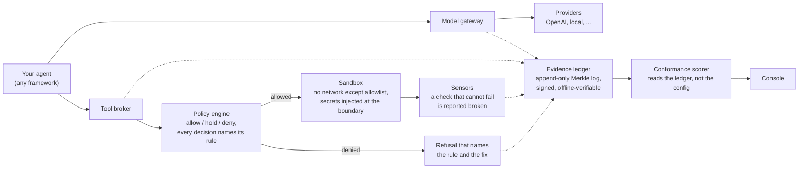
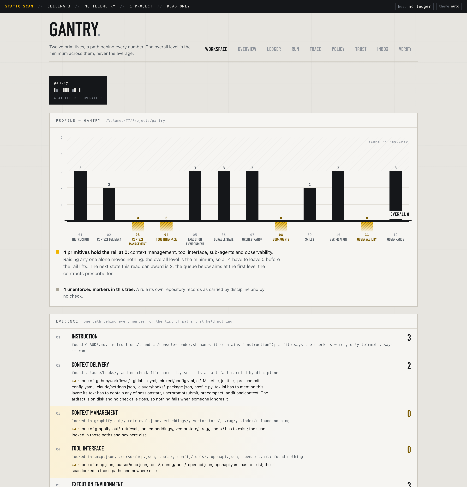
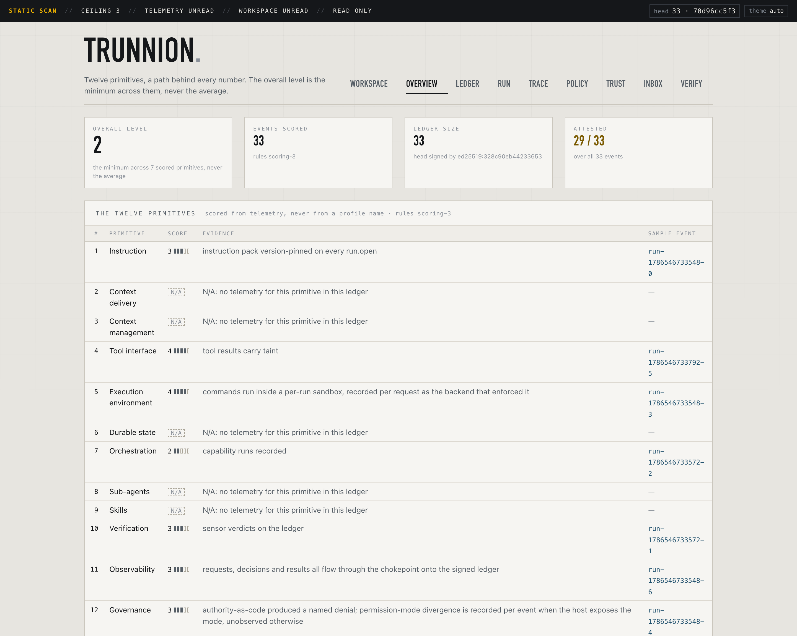
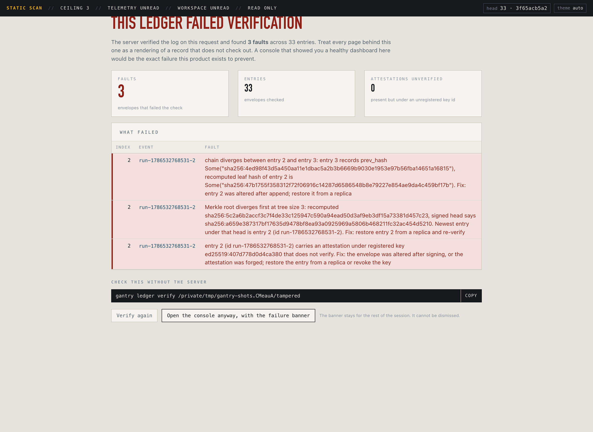

<p align="center">
  
</p>

# Trunnion

**A control plane that sits between your AI agents and everything they can
touch, records every decision on a tamper-evident log, and scores how well it
is doing that from its own telemetry rather than its own documentation.**

One static binary. No cloud account, no phone-home, runs air-gapped. Works
with any model provider and under any agent framework.

<p align="center">
  
</p>

Four commands, and every line above came out of the binary. `dev/termcast.py`
runs the tape in `dev/readme-cast.tape` and draws what it printed, so the
animation cannot show output trunnion did not produce. It is a plain SVG with no
script and no host to fetch anything from, because a README that phones out on
the first screen would contradict the paragraph above it.

The same material with the terminal, the policy simulator and the scorecard
you can click through is at **[mariano215.github.io/trunnion](https://mariano215.github.io/trunnion/)**.
It is served as static files that reference no host either, which
`ci/site-offline.sh` holds by rendering the page with every name but loopback
unresolvable.

## The problem, in plain English

An agent is two things: a model, and the harness around it. The model writes
the code. The harness decides whether the command it just proposed is allowed
to run, what credentials it can see, what happens when a check fails, and
whether anyone can reconstruct all of that afterwards.

The industry spent five years on the model half. The harness half is still
hand-assembled at every company that needs one: a permissions file here, some
logging there, an approval step that exists in a Slack thread. It works until
someone asks a question it cannot answer.

Three questions in particular:

1. **What did the agent actually do last Tuesday?** Not the chat transcript.
   Which tools it called, with what arguments, under what policy version,
   approved by whom.
2. **What stopped it from doing worse?** If the answer is "the prompt told it
   not to," you have a suggestion, not a control.
3. **Can someone who was not in the room verify any of that?** Logs you can
   edit prove nothing about a system you operate.

Trunnion is the harness half, built as a product instead of assembled per
project. Every model call goes through one gateway. Every tool call goes
through one broker that consults a policy and names the rule behind each
decision. Both write to an append-only cryptographic log that a third party
can verify offline, without trusting the binary that wrote it.



Solid arrows are the request path. Dotted arrows are the record: nothing is
trusted that is not on it, and the score at the end is derived from that
record rather than from what any config file claims.

New to the vocabulary? `docs/GLOSSARY.md` defines every term here, grouped by
what you are trying to work out, and says plainly which ones are declared but
not yet running.

## Getting it

Three ways, and none of them needs an account.

**A container.** Nothing to install but Docker. The isolation is real in here:
a plain unprivileged `docker run` with no flags gets Landlock, because the
backend was chosen for exactly that property.

```
docker pull ghcr.io/mariano215/trunnion:latest
docker run --rm -v "$PWD:/harness" ghcr.io/mariano215/trunnion \
  template init /usr/share/trunnion/templates/laptop /harness/myharness
```

**A binary.** Every release carries a macOS (Apple silicon) and a Linux
(x86_64) archive with a checksum file. Download, check it, put `trunnion` on your
path.

```
sha256sum -c SHA256SUMS
```

**From source.** A Rust toolchain and one command. This is what the rest of
this README uses, because it also gets you the repository the examples run
against.

```
cargo build
```

## What the commands do, in plain English

`trunnion` with no arguments lists every form. In ordinary words:

| Command | What it does |
|---|---|
| `trunnion template init <template> <dir>` | Creates a working harness in an empty directory: a policy, scoring rules, sensors, and a signing key generated for that install alone. This is the first thing to run. |
| `trunnion broker call <ledger-dir> <tool> <target>` | Asks to run one tool call. The policy decides, the answer and its reason go on the log, and if it is allowed the command runs inside a sandbox. This is the thing your agent calls instead of running commands itself. |
| `trunnion approve <ledger-dir> <request-id> <approver> [approve\|deny]` | Answers a call the policy put on hold. A named human, on the record. Add `deny` as a last argument to refuse, which is also recorded: "nobody looked" and "somebody said no" are different states. |
| `trunnion ledger verify <ledger-dir>` | Recomputes the whole log from scratch and reports any entry that does not check out. Run it against a log someone hands you; it needs nothing but the directory. |
| `trunnion ledger anchor <ledger-dir> <anchor-file>` | Writes a copy of the current signed head somewhere outside the log. This is what catches a writer who rewrites their own history, which verification alone cannot. |
| `trunnion score <ledger-dir> [scoring.json]` | Scores the twelve primitives from what the log says actually happened. It reads events, never configuration, so it cannot be talked into a better number. |
| `trunnion scan <repo-dir>` | Looks at a repository on disk and scores it without running anything. Caps at 3, because a file can say a check is wired and only a run says it fired. Writes nothing to what it reads. |
| `trunnion project add\|list\|scan\|remediate <...>` | Manages a set of repositories, so one install answers for many projects. `remediate` turns each gap into a brief you can paste into an agent, in the contracts' own words. |
| `trunnion console [ledger-dir]` | Serves the read-only web console on loopback. With a ledger it shows that log; with no argument it shows every registered project. It writes nothing, ever. |
| `trunnion drift <ledger-dir> <policy.json>` | Checks that what the policy claims about the machine is still true of the machine, and reports every claim it cannot check rather than passing it quietly. |
| `trunnion sensor live <sensor.json>...` | Runs every sensor against content it must reject. A sensor that has quietly stopped working is reported broken rather than clean. |

## The first hour

What follows is one sitting, start to finish: build it, point it at a tool
call, watch the call get refused, then check the record yourself and score it.
Every command and every block of output below came from a real run on a laptop.
Nothing is a mock-up.

### Build it and make a ledger

Rust toolchain, then two commands. These run from the repository root; the last
part of this section shows the same thing in a directory of your own.

```
$ cargo build
$ ./target/debug/trunnion ledger init /tmp/demo/ledger
ledger initialised at /tmp/demo/ledger
```

That is a directory holding an append-only event log, its signed tree heads,
the payloads, and the ledger's own signing key. Nothing else needs to be
running. There is no daemon, no database and no account.

### The first denial

Ask the tool broker to run something destructive. Your agent would normally do
this through the broker instead of a shell; the CLI is the same code path.

```
$ ./target/debug/trunnion broker call /tmp/demo/ledger Bash "rm -rf /"
policy denied Bash on rm -rf /: rule r-destructive-shell fired and the
decision is on the ledger. Fix: This command is destructive and its
capability's rollback handle cannot recall it. Scope the deletion to a path
the run owns, or route it through a capability whose rollback genuinely
covers it.
refusal recorded (ledger sealed at size 8)
$ echo $?
1
```

Three things happened that a permissions file would not have done. The refusal
names the rule that produced it (`r-destructive-shell`, in
`config/policy.json`), so you can go and read the reason rather than guess it.
The message names the action to take, because the reader is usually an agent
and "denied" is not something an agent can act on. And the decision is an event
on the log before the process exits, so a denial is a thing that happened
rather than an absence you have to infer later.

Now do something allowed:

```
$ ./target/debug/trunnion broker call /tmp/demo/ledger Read docs/PLAN.md
... file contents ...
[taint: true] (ledger sealed at size 15)
```

It ran inside a per-run sandbox with the network denied and writes scoped to a
scratch directory, and the result came back marked tainted, which means it is
data and not instruction.

### What the ledger holds afterwards

Fifteen events, two runs. Both share the same seven-event spine:

```
run.open        the profile, the instruction pack hash, the settings hash
tool.register   the two built-in tools, Read and Bash, each accepted
tool.register   against its declared schema
tool.request    tool, canonical args, sandbox backend, credential handles
policy.decision exactly one per call, allow or deny, naming its rule
tool.result     outcome, result hash, taint, duration
run.seal        outcome and the signed tree head at seal
```

The denied run carries one more, a `rung.change` between the decision and the
result. A denial costs the capability a rung, so autonomy comes down on bad
behaviour and not only on a failed sensor, and the demotion is on the record
next to the decision that caused it rather than inferred later.

The decision event's payload is the whole adjudication, and it is what an
incident review reads (abridged here, the message is quoted in full above):

```json
{"capability":"shell.exec","effect":"write.local","gate":"post",
 "identity":{"id":"user:mariano@local","source":"local"},
 "message":"This command is destructive and its capability's rollback ...",
 "request":{"args_hash":"sha256:2f3b9457...","target":"rm -rf /","tool":"Bash"},
 "rule":"r-destructive-shell","rung":"autonomous","verdict":"deny"}
```

Every envelope also carries an authority block, on ordinary events and not only
privileged ones, because the cheapest way to answer "under whose authority" is
to never have an event that cannot:

```json
{"profile":"laptop",
 "policy_version":"sha256:b1d79eab...",
 "instruction_version":"sha256:e087ac11...",
 "settings_hash":"sha256:5a22b9dd...",
 "permission_mode":"bypassPermissions",
 "diverged":["host_permissions.permission_mode"]}
```

That last pair is worth slowing down on. This run happened inside a Claude Code
session running in bypass mode, while the tracked `.claude/settings.json`
declares no default mode, which means `default`. The two disagree, and the
event says so, on the event, at the time. Run the same command outside a
session that sets `CLAUDE_PERMISSION_MODE` and the field reads `"unobserved"`
and nothing is reported as diverged, because an absent signal is written down
rather than guessed into a value.

### Check the record yourself

Verification is a local command. It walks the hash chain, recomputes the Merkle
tree against every signed head, checks that no tail of the log is uncovered,
confirms every payload is present or lawfully expired, and checks each
attestation against the registered keys:

```
$ ./target/debug/trunnion ledger verify /tmp/demo/ledger
entries: 15
attestations verified against config/actor-keys.json: 15
of those, 15 were signed under a key whose seed is published, so they prove
which run wrote the event and not who operated it; a deployment registers its
own key and keeps the seed
```

The second paragraph is the point. The laptop profile's signing seed is tracked
in this repository, so anyone holding the checkout can produce a signature that
verifies. That is real provenance and it is not attribution, so the tool says
so rather than printing the line an HSM-backed deployment would print. A
harness you create with `template init` generates its own key and prints only
the first two lines.

You do not have to trust that binary either. Export one event as an inclusion
bundle and check it somewhere else, with no ledger directory and no network:

```
$ mkdir -p /tmp/offline
$ ./target/debug/trunnion ledger prove /tmp/demo/ledger 4 > /tmp/offline/bundle.json
$ cp /tmp/demo/ledger/keys/ledger.pub /tmp/offline/
$ cd /tmp/offline && ls
bundle.json  ledger.pub
$ sandbox-exec -p '(version 1)(allow default)(deny network*)' \
    trunnion ledger verify-inclusion bundle.json ledger.pub
inclusion verified: entry 4 (id run-1785937403180-4) under signed head size 15
```

The bundle is 1673 bytes: one envelope, its index, a four-element proof and
one signed head. That is the whole evidence package for "this decision was on
the log, in this position, at this size."

### What a tampered log looks like

Copy the ledger, change one character of one timestamp, and verify again:

```
$ trunnion ledger verify /tmp/demo/tampered
entries: 15
attestations verified against config/actor-keys.json: 14
entry 4 (run-1785937403180-4): chain diverges between entry 4 and entry 5 ...
  Fix: entry 4 was altered after append; restore it from a replica
entry 4 (run-1785937403180-4): Merkle root diverges first at tree size 5 ...
  Fix: restore entry 4 from a replica and re-verify
entry 4 (run-1785937403180-4): carries an attestation under registered key
  ed25519:407d778d... that does not verify. Fix: the envelope was altered
  after signing, or the attestation was forged; restore the entry from a
  replica or revoke the key
```

One edit, three independent detections, each naming the entry and what to do.
Exit code 1.

### Score what just happened

```
$ ./target/debug/trunnion score /tmp/demo/ledger
| Primitive | Score | Evidence |
|---|---|---|
| 01 Instruction | 3 | instruction pack version-pinned on every run.open |
| 02 Context delivery | N/A | N/A: no telemetry for this primitive in this ledger |
| 03 Context management | N/A | N/A: no telemetry for this primitive in this ledger |
| 04 Tool interface | 4 | tool results carry taint |
| 05 Execution environment | 4 | commands run inside a per-run sandbox, recorded per request as the backend that enforced it |
| 06 Durable state | N/A | N/A: no telemetry for this primitive in this ledger |
| 07 Orchestration | N/A | N/A: no telemetry for this primitive in this ledger |
| 08 Sub-agents | N/A | N/A: no telemetry for this primitive in this ledger |
| 09 Skills | N/A | N/A: no telemetry for this primitive in this ledger |
| 10 Verification | N/A | N/A: no telemetry for this primitive in this ledger |
| 11 Observability | 3 | requests, decisions and results all flow through the chokepoint onto the signed ledger |
| 12 Governance | 3 | authority-as-code produced a named denial; permission-mode divergence is recorded per event when the host exposes the mode, unobserved otherwise |

**Overall level: 3** (the minimum across 5 scored primitives, not the average). Rules scoring-3, 15 events scored.
```

The N/A rows are the point. Those seven layers were never exercised in this
ledger, so they are reported as unmeasured rather than assumed fine. Scoring is
itself an event, so the entry count grows each time you run it.

To exercise every layer at once and reproduce the full scorecard further down
this file:

```
zsh docs/proof/08-run.sh
```

### Look at it

```
$ ./target/debug/trunnion console /tmp/demo/ledger 127.0.0.1:8731
console at http://127.0.0.1:8731/ (ctrl-c to stop)
```

Six views over the same ledger you just verified, served by the same binary
from the same process. The overview is the scorecard plus the signed head and
the attestation coverage; the Run view is the waterfall an incident review
reads; the Policy view shows every rule with how many times it fired, including
the ones that never did. Screenshots and the full list are in
[The console](#the-console) below.

Point it at the tampered copy instead and the failure takes over the page. The
console never claims to have verified anything itself: it reports what the
server found and prints the offline command that checks the server.

### Starting a harness of your own

The binary reads `config/policy.json`, `config/providers.json`,
`config/scoring.json` and `instructions/pack.md` relative to the working
directory, and takes each sensor by path. `template init` writes that whole
layout, sensors included, so a new directory runs standalone:

```
$ ./target/debug/trunnion template init templates/laptop ~/my-harness
template templates/laptop validates: profile laptop, 5 capabilities, 8 rules,
3 provider(s), 12 scoring rule(s), 2 sensor(s), 1 signing key(s)
wrote /Users/you/my-harness/config/policy.json
wrote /Users/you/my-harness/config/providers.json
wrote /Users/you/my-harness/config/scoring.json
wrote /Users/you/my-harness/instructions/pack.md
wrote /Users/you/my-harness/config/sensors/instruction-lifecycle.json
wrote /Users/you/my-harness/config/sensors/no-private-key.json
wrote /Users/you/my-harness/config/skill-keys.json
wrote /Users/you/my-harness/config/actor-keys.json
wrote /Users/you/my-harness/config/actor-key.seed (mode 0600)
harness initialised at /Users/you/my-harness from template templates/laptop,
signing as ed25519:86c50d2267d253d4
```

The signing key is generated per install from OS entropy, so no two harnesses
share an identity and the template ships no key material at all. Run the
commands above inside the new directory and verification prints two lines
rather than three:

```
$ cd ~/my-harness
$ trunnion broker call .ledger Read instructions/pack.md
$ trunnion ledger verify .ledger
entries: 7
attestations verified against config/actor-keys.json: 7
```

Edit `config/policy.json` to declare your capabilities and rules, and replace
`instructions/pack.md` with your own; its hash is pinned onto every event, so
changing it is a recorded change rather than a quiet one.

The bundle validates as a whole before a single file is copied, and every
destination path is checked before the first write, so a refused init leaves no
half-written harness. Every part loads through the same validator the running
system uses, which is what stops a template from producing a directory the
platform would refuse at runtime. `trunnion template validate <dir>` runs that
check on its own, and CI runs it on every push.

### What you have not seen

An hour gets you the record, the refusal, the sandbox and the score. It skips
the third verdict: a `hold`, where the policy neither permits nor refuses but
waits for a human. That path runs, and it is the shortest way to see the whole
idea in one place:

```
$ trunnion broker call /tmp/demo/ledger Bash "git push origin main"
policy held Bash on git push origin main: rule r-publish gates this call pre
and no approval on this ledger releases it.

$ trunnion approve /tmp/demo/ledger <request-id> user:you@example.com
approval run-...-0: user:you@example.com recorded approve for rule r-publish

$ trunnion broker call /tmp/demo/ledger Bash "git push origin main"
[taint: true]
```

The decision event still reads `hold` afterwards, because that is what the
policy computed; the release is a separate `approval.use`. Read the ledger top
to bottom and it says: held, approved, spent, ran. `docs/proof/14.md` has the
whole arc including the cases that must fail.

An hour also does not get you an anchored head, a drift report over the whole
profile, or a microVM, because none of those is built. Isolation is real on
macOS and Linux and nowhere else: seatbelt and Landlock ABI v4.
`docs/GLOSSARY.md` ends with the full list of terms that are declared and not
yet running, and each proof document in `docs/proof/` closes with its own
section on what is still a guide.

## Why you would want it

- **You are shipping agents that touch production.** You need a place where
  authority is declared once, enforced in code, and recorded, instead of
  spread across prompts and config files.
- **Someone is going to audit this.** A security review, a client, a
  regulator. Trunnion produces evidence as a side effect of running, so the
  answer is a log export, not a reconstruction project.
- **You cannot send data out.** No hosted control plane, no licence check, no
  CDN font. The test suite runs with an empty network namespace, which is what
  keeps that claim honest.
- **You do not want to marry a framework.** Trunnion sits underneath LangGraph,
  Temporal, Claude Code, or a shell script. Point your existing harness at the
  gateway and broker and you inherit the tool, sandbox, observability and
  governance layers without rewriting your agent.
- **You want a number you can defend.** The scorer reads what actually ran. A
  layer with no telemetry scores N/A, not a generous guess.

**What it is not:** not an agent framework, not a chat product, not an eval
platform, not a skills marketplace, not a compliance certification. It
produces evidence. Interpreting that evidence against a regime is a separate
job.

## The twelve primitives, in plain English

Trunnion is organised around a rubric that decomposes any agent harness into
twelve layers. The rubric is the measuring instrument; Trunnion is that
instrument pointed at itself and satisfied by construction.

Each layer scores 0 to 5. The overall level is the **minimum**, never the
average, because one missing layer is what an attacker or an auditor finds.
Nine strong layers and no record of what happened is a weak system.

| # | Layer | What it means | What goes wrong without it |
|---|---|---|---|
| 01 | Instruction | Who the agent is and the rules it works under, kept in version control like code | Prompts edited live in a dashboard. Nobody can say what the agent was told last week |
| 02 | Context delivery | Actually handing the model the file, the failing test, the stack trace | The agent is asked about a system it was never shown, and the hallucination gets blamed on the model |
| 03 | Context management | Choosing what enters the window right now, against a budget, with stale material expired | Whole wikis stuffed into every prompt. Wrong context is worse than none: it is a plausible distraction that fails confidently |
| 04 | Tool interface | Structured calls with names, schemas and validated inputs, and tool output treated as untrusted | A tool called "run any shell command," and its output piped straight into the next decision |
| 05 | Execution environment | Where commands run and with what access: sandbox, filesystem scope, network rules, credentials | The agent runs with a developer's full credentials on their laptop. This is a security finding, not a maturity gap |
| 06 | Durable state | The workbench that survives a crash: plans, checkpoints, task state, a graph of the codebase | Everything lives in the conversation. Every session restarts from zero |
| 07 | Orchestration | How work moves: retries, gates, approvals, escalation, step ordering | One loop that either succeeds or dies. A human finds out from the output, or never |
| 08 | Sub-agents | Splitting work into specialists with narrow scope, narrow context and narrow tools | Either one agent does everything, or a swarm exists for show with no consistency |
| 09 | Skills | Reusable procedures loaded at the right moment, with steps and tools named | The process lives in one person's head or one old thread |
| 10 | Verification | The agent says done, the harness says show me: tests, builds, type checks, evals | The final sentence is trusted because it sounds confident. The most common and most silent failure in the field |
| 11 | Observability | The recorder: tool timelines, cost, prompt versions, approvals, replayable | Service-uptime monitoring mistaken for agent observability. Nobody can reconstruct the run |
| 12 | Governance | Who the agent acts as, what it may do, under which policy, and the record that proves it | The authority is real but undeclared, inherited from whoever set up the machine, and nothing reports when the running system drifts from the stated policy |

Layers 10, 11 and 12 are the trust layers. They are the ones nobody builds,
and because the score is a minimum, they are usually the ones setting it.

Full definitions with scoring anchors: `docs/PRIMITIVES.md`.

## The console

The binary serves an operator console from the same process. No second
service, no build step, no package manager: the assets are hand-written HTML,
CSS and ES modules embedded at compile time, and the logo travels as a data
URI. Nothing is fetched from any host, which is what lets the air-gap claim
survive having a UI at all.

Started with no argument it answers for the whole workspace, which needs no
ledger at all: a static scan reads a tree, and a tree has no log.

```
$ ./target/debug/trunnion console
console at http://127.0.0.1:49159/ (ctrl-c to stop)
```

<p align="center">
  
</p>

The rail rests on the shortest bar, because the overall level is the minimum
and never the average. The primitives holding it down are marked, the band a
static read cannot enter is drawn rather than described, and every number has
the path it came from underneath it. Below the chart, the same page carries
the remediation queue in the contracts' own words.

Started against a ledger it answers for that log instead:

```
$ ./target/debug/trunnion console /tmp/demo/ledger 127.0.0.1:8731
console at http://127.0.0.1:8731/ (ctrl-c to stop)
```

<p align="center">
  
</p>

Nine views over a read-only JSON API (`docs/CONSOLE-API.md`):

- **Workspace**, above. Every registered project scored, the twelve
  primitives as a rail chart, the evidence behind each number and the
  remediation queue.
- **Overview**, the scorecard for one ledger. The overall level, the twelve primitives with the
  evidence sentence behind each number, event volume, the signed tree head,
  and how many events carry an attestation.
- **Ledger**, the event stream with filters by kind, run, actor and time.
  Expand a row for its subject, authority block, attestation state and
  position in the tree.
- **Run**, one run as a waterfall: model calls, tool requests, policy
  decisions, sandbox executions and sensor verdicts in order, denial reasons
  inline. An incident review reads this and nothing else.
- **Policy**, every rule with its decision, message and how many times it
  fired. A rule that never fires is shown, not hidden.
- **Trust**, each capability's declared rung against the rung it earned from
  replay, and which one the broker actually gates on.
- **Trace**, the ledger as swimlanes on a clock, one lane per actor, with an
  arrow only where a producer recorded a handoff. The picture is sparse and
  the sparseness is the finding.
- **Inbox**, every call the policy held, what the record says has happened to
  it, and the exact `trunnion approve` command that resolves it.
- **Verify**, the verification result and the offline command that reproduces
  it.

The API is read-only by decision. It cannot approve, promote, demote or
append, because a UI that can move a rung is an authority surface and the
laptop profile has no identity story for one. It binds loopback by default.

### It refuses to render a broken ledger as a healthy one

Alter one event on a ledger and the console does not show you a dashboard
with a warning badge. The failure takes over:

<p align="center">
  
</p>

Three faults named, including the attestation that no longer verifies, the
exact offline command that reaches the same verdict without the server, and a
banner that cannot be dismissed for the rest of the session. The console
never claims to have verified anything itself. It reports what the server
found and hands you the command that checks the server.

`trunnion score <ledger> <rules.json> <out.html>` still writes the scorecard as
a single self-contained file, for attaching to a report.

Not built yet: no inclusion-proof view, no sensor board, no anchoring view.
Live update is a poll, not a stream, and only the ledger view polls.

## What runs today

- **Evidence ledger** (`src/ledger.rs`): append-only Merkle log, RFC 6962
  construction, signed tree heads, offline inclusion and consistency proofs.
  Nothing is trusted that is not on this record. Actor attestations verify
  against a registered key or are counted as unverified, never assumed.
- **Model gateway** (`src/gateway.rs`): the one chokepoint every model call
  passes, normalising across providers and pinning the instruction and policy
  version per call. A code path that reaches a provider SDK directly fails the
  build.
- **Tool broker and policy engine** (`src/broker.rs`, `src/policy.rs`): one
  policy decision per tool call, an MCP-shaped registry that refuses loose
  tool definitions, and denials that name their rule. A deny rule shadowed by
  an earlier allow refuses to load rather than sitting there unreachable.
- **Sandbox and credential broker** (`src/sandbox.rs`, `src/secrets.rs`):
  per-run isolation (seatbelt on macOS, Landlock ABI v4 on Linux), network
  denied except an allowlist, and secrets
  the model never sees. Agents hold handles; the broker substitutes the real
  value into the child process environment at the boundary, never into a
  prompt, a command string or an event.
- **Sensor bus** (`src/sensor.rs`): checks with lifecycle placement whose
  verdicts name the fix. Every sensor declares a negative control it must
  reject, so a sensor that has quietly stopped working is reported broken
  rather than clean. A green board of dead sensors is the failure mode this
  prevents.
- **Orchestrator and trust budget** (`src/trust.rs`): every capability holds a
  rung that decides where the human stands. Rungs are earned by clean sensor
  history under a named approver and lost automatically on the next failure,
  and the current rung is replayed from the ledger rather than stored.
- **Durable state and corpus graph** (`src/durable.rs`, `src/graph.rs`): a
  killed run resumes from its last checkpoint; the graph answers questions
  about the codebase by reading a fraction of a flat scan, and reports the
  cases where it loses.
- **Skills and delegation** (`src/skills.rs`): signed skill packages resolved
  against a managed key registry or refused. A package with broken metadata, a
  missing step or an unverifiable signature is refused at resolve time, never
  published on its title. Delegation can only narrow scope.
- **Conformance scorer** (`src/scorer.rs`): the rubric as a running service.
  Every predicate is a statement about ledger events, so it cannot be talked
  into a better number.
- **Console and its API** (`src/console.rs`, `assets/`): eight read-only
  routes over the ledger, three more over the workspace, and nine views on top
  of them, served by the same
  binary from the same process, standard library only and no new dependency.

`trunnion` with no arguments lists every subcommand.

## Trunnion scored by Trunnion

The table below is produced by `trunnion score` reading a ledger that exercised
the layers, not by reading this file. The scoring rules are data
(`config/scoring.json`), so anyone holding an exported ledger re-derives the
same twelve numbers without trusting the binary.

| # | Primitive | Score | Why |
|---|---|---|---|
| 01 | Instruction | 4 | The instruction-lifecycle sensor gates the pack against a review record. The level is earned by the control running, never by it failing. |
| 02 | Context delivery | 3 | Normalised model.call events with a pinned prompt hash. |
| 03 | Context management | 3 | Window budget and actual recorded per call; graph retrieval ledgered with its byte cost and staleness re-reads. |
| 04 | Tool interface | 4 | MCP-shaped registry, taint on every result. |
| 05 | Execution environment | 4 | Commands run inside a per-run sandbox, recorded per request as the backend that enforced it. |
| 06 | Durable state | 3 | A run resumed from a checkpoint: the seam is on the record. |
| 07 | Orchestration | 4 | A human gate ran at an irreversible step: the policy held the call, and a human answered it on the record. Approve and refuse earn the same level, because a refusal is the gate working. |
| 08 | Sub-agents | 3 | A delegated run records subagent.spawn, and the chokepoint denies an out-of-grant call with rule r-delegation. |
| 09 | Skills | 3 | Signed packages resolved against the managed key registry or refused; resolved steps execute through the broker under the delegated grant. |
| 10 | Verification | 4 | A sensor that could not fail was reported broken, not clean. |
| 11 | Observability | 3 | Requests, decisions and results all flow through the chokepoint onto the signed ledger. |
| 12 | Governance | 4 | Authority-as-code produced a named denial; the drift walk reported every profile requirement, and run open recorded what this machine could not provide. The level is the walk having run, not what it found. |

**Overall level: 3.** Six layers stand at 4, and six sit at 3, which is why the
overall number has not moved: it is the minimum, and the minimum is the honest
figure. Primitive 01 reached 4 when the instruction-lifecycle sensor started
gating the pack and `docs/proof/08-run.sh` started running it; 07 and 12
reached 4 when the same script started holding a call for a human and walking
the profile requirements. In all three cases adding the scoring rule alone
changed nothing, because the self-audit did not exercise the layer, and the
scorer reads telemetry. That is the whole design working: the number follows
the record, including when the record is disappointing.

Reproduce:

```
cargo build
zsh docs/proof/08-run.sh
```

## How strictness is selected

One profile sets isolation, gate placement, anchoring and identity together.
`laptop` is the default and ships in `templates/laptop`.

| Profile | Isolation | Identity | Ledger | Default rung |
|---|---|---|---|---|
| `laptop` | per-run confinement (seatbelt or Landlock v4), empty egress allowlist | local accounts | local file | autonomous, post-hoc review |
| `team` | kernel-level sandbox | OIDC | anchored daily to object storage | assisted |
| `regulated` | microVM | OIDC required, no local fallback | HSM or TPM keys, external timestamping | assisted, no promotion without a named approver |

`laptop` is the only row that runs. It is what the tracked policy declares,
what `templates/laptop` ships, and what every proof document exercises. The
other two rows are the design, and the parts of them that exist today are the
profile field itself and one refusal: a profile other than `laptop` that
declares a signing key whose seed is published refuses to start. The isolation
backends, OIDC, anchoring and `on_unavailable: refuse` are not built. See the
last section of `docs/GLOSSARY.md`.

The rule that keeps this honest is that the scorer reads what is running and
never the profile name. Seatbelt on the laptop profile scores 4 on execution
environment, from a `sandbox` field observed on every tool request rather than
from the policy's own claim; a host with no `sandbox-exec` records `none` and
the isolation claim is honestly unmet rather than silently bypassed.

## Building

Rust, one static binary, no runtime to install on the target.

```
cargo build
cargo test
zsh ci/run.sh    # format, clippy as errors, offline suite, policy parity, sensor liveness
```

The suite runs offline. `tests/invariants.rs` fails the build if the HTTP
client is referenced outside the gateway, which is how the one-chokepoint rule
stays true instead of being a paragraph in a guide.

On a machine where a tool named `cc` shadows the C compiler on `PATH`,
`.cargo/config.toml` pins the linker and `CC` to `/usr/bin/cc` so the build
does not depend on `PATH` order.

## Where to read next

| File | What it answers |
|---|---|
| `docs/GLOSSARY.md` | Every term this project uses, grouped by what you are trying to work out, ending with the ones that are declared and not yet running |
| `docs/PRIMITIVES.md` | The full rubric with scoring anchors for all twelve layers |
| `docs/CONCEPT.md` | The thesis and the architecture decisions, including why not blockchain |
| `docs/PLAN.md` | The slice order for the first nine, and why each made the next one safer |
| `docs/PLAN-2.md` | What is left after those nine, and the order it lands in |
| `docs/CONSOLE-API.md` | The read-only API the console renders, and the rules it must not break |
| `docs/POLICY-SCHEMA.md` | How to write policy: rules, capabilities, gates, rollback handles |
| `docs/EVENT-SCHEMA.md` | Every event type on the ledger and its fields |
| `docs/proof/` | One adversarial proof per slice. Each was produced by running the thing, not by reasoning about it |
| [assay](https://github.com/Mariano215/assay) | The worked example: a sandboxed repository audit run six times, adding one control per stage, ending in a signed findings report a recipient checks with the binary alone |
| `docs/DEPENDENCIES.md` | Every dependency and why it is here. CI fails on an undocumented one |
| `CLAUDE.md` | The invariants an agent working on this repo must hold, each naming what enforces it |

## Attribution

Two sources are load-bearing. The twelve-primitive decomposition of an agent
harness, and Birgitta Böckeler's guide and sensor taxonomy (martinfowler.com,
April 2026), which is where the distinction between a rule that advises and a
check that fires comes from.

## Licence

Built and maintained by [Mattei Systems](https://matteisystems.com).

Mattei Systems sells assessments against this model, which is a conflict worth
stating rather than leaving for a reader to discover: the scoring logic is open,
every number names the evidence behind it, and any finding this tool produces is
verifiable by someone who does not work here. The
[specification's governance document](https://github.com/Mariano215/agent-harness-maturity/blob/main/GOVERNANCE.md)
carries the same statement and the mitigations that go with it.

Apache License 2.0, full text in `LICENSE`. Apache rather than MIT because
this is a security control plane meant to be embedded in other people's
stacks, and Apache carries an explicit patent grant that enterprise legal
review looks for. Copyright Mariano215.

## Status

Pre-1.0. Every slice built so far carries a proof document produced by running
it, numbered 00 through 23 in `docs/proof/`; the API is not yet stable. The
name collides with a long-running Joomla template framework, so the published
package name may differ.
